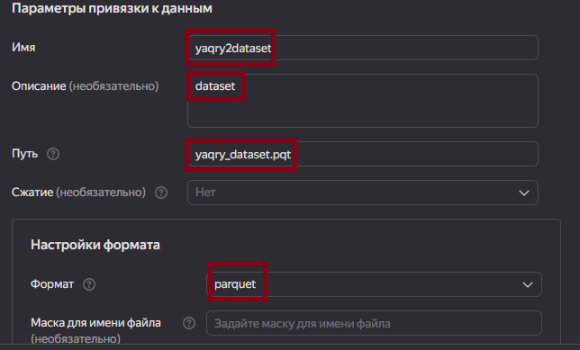

# Практическая работа 1

# Использование технологии Yandex Query для анализа данных сетевой активности

## Цель работы

1.  Изучить возможности технологии Yandex Query для анализа
    структурированных наборов данных.

2.  Получить навыки построения аналитического пайплайна для анализа
    данных с помощью сервисов Yandex Cloud.

3.  Закрепить практические навыки использования SQL для анализа данных
    сетевой активности в сегментированной корпоративной сеть.

## Задание

Используя сервис Yandex Query настроить доступ к данным, хранящимся в
сервисе хранения данных Yandex Object Storage. При помощи
соответствующих SQL запросов ответить на вопросы.

## Ход работы

Для выполнения предложенного задания нам необходимо последовательно
проделать следующие шаги:

1.  Проверить доступность данных в Yandex Object Storage Проверьте
    доступность данных (файл yaqry_dataset.pqt) в бакете arrow-datasets
    S3 хранилища Yandex Object Storage. Проверить можно просто перейдя
    по правильно сконструированному URL в браузере.

`https://storage.yandexcloud.net/arrow-datasets/yaqry_dataset.pqt`

1.  Подключить бакет как источник данных для Yandex Query

Yandex Query – это облачное решение для анализа данных, в котором задачи
организации хранения, обеспечения доступа и выполнения первичного
анализа данных полностью берет на себя сервис-провайдер, то есть Yandex
Cloud.

Перед проведением анализа нам надо связать Yandex Query с хранилищем
наших данных. В нашем случае это S3 Object Storage от Yandex Cloud.

1.  Создать соединение для бакета в S3 хранилище

1.  Заполняем поля с учетом допустимых символов, выбираем тип
    аутентификации – публичный. Вводим имя бакета в соответствующее поле
    и сохраняем.

1.  Теперь, после создания соединения, укажем какой объект использовать
    в качестве источника данных. Для этого нужно сделать привязку
    данных.

1.  Настройка привязки данных

<!-- -->

    SCHEMA=(
    timestamp TIMESTAMP NOT NULL,
    src STRING,
    dst STRING,
    port INT32,
    bytes INT32
    )

Если настройки сделаны правильно, то можно попробовать сделать
аналитический запрос и посмотреть результат

## Анализ

-   Решите следующие задания:

1.  Известно, что IP адреса внутренней сети начинаются с октетов,
    принадлежащих интервалу \[12-14\]. Определите количество хостов
    внутренней сети, представленных в датасете.

<!-- -->

    SELECT COUNT(DISTINCT src) AS host_count
    FROM yaqry2dataset
    WHERE src REGEXP '(^1[2-4].)';

В SQL-запросе мы используем функцию COUNT(DISTINCT src) для подсчета
количества уникальных значений столбца src в таблице yaqry2dataset,
которые удовлетворяют условию фильтрации. В разделе WHERE мы используем
оператор REGEXP для указания регулярного выражения. В данном случае мы
ищем строки, где значение столбца src начинается с числа 1, а следующий
символ является числом от 2 до 4. Знак ^ в регулярном выражении означает
начало строки, а \[2-4\] означает любое число от 2 до 4.

1.  Определите суммарный объем исходящего трафика

<!-- -->

    SELECT SUM(bytes) AS bytes, 
           SUM(bytes) / (1024 * 1024) AS Mb,
           SUM(bytes) / (1024 * 1024 * 1024) AS Gb
    FROM yaqry2dataset
    WHERE src REGEXP '(^1[2-4].)';

В SQL-запросе мы используем функцию агрегации SUM для расчета суммарного
объема данных в столбце bytes таблицы yaqry2dataset, которые
удовлетворяют условию фильтрации. Затем мы добавляем два столбца с
алиасами Mb и Gb. В столбце Mb мы делим суммарный объем байтов на (1024
\* 1024) для получения объема данных в мегабайтах. В столбце Gb мы делим
суммарный объем байтов на (1024 \* 1024 \* 1024) для получения объема
данных в гигабайтах. В разделе WHERE мы используем оператор REGEXP для
указания регулярного выражения. В данном случае мы фильтруем строки, где
значение столбца src начинается с числа 1, а следующий символ является
числом от 2 до 4. Знак ^ в регулярном выражении означает начало строки,
а \[2-4\] означает любое число от 2 до 4.

1.  Определите суммарный объем входящего трафика

<!-- -->

    SELECT SUM(bytes) AS bytes, 
           SUM(bytes) / (1024 * 1024) AS Mb,
           SUM(bytes) / (1024 * 1024 * 1024) AS Gb
    FROM yaqry2dataset
    WHERE dst REGEXP '(^1[2-4].)';

В SQL-запросе мы используем функцию агрегации SUM для расчета суммарного
объема данных в столбце bytes таблицы yaqry2dataset, которые
удовлетворяют условию фильтрации. Затем мы добавляем два столбца с
алиасами Mb и Gb. В столбце Mb мы делим суммарный объем байтов на (1024
\* 1024) для получения объема данных в мегабайтах. В столбце Gb мы делим
суммарный объем байтов на (1024 \* 1024 \* 1024) для получения объема
данных в гигабайтах. В разделе WHERE мы используем оператор REGEXP для
указания регулярного выражения. В данном случае мы фильтруем строки, где
значение столбца dst начинается с числа 1, а следующий символ является
числом от 2 до 4. Знак ^ в регулярном выражении означает начало строки,
а \[2-4\] означает любое число от 2 до 4.

## Вывод

В ходе достижения поставленных целей были развиты практические навыки по
использованию технологии Yandex Query для анализа структурированных
наборов данных. Было изучено, как проводить аналитические запросы на
данных, работать с большими объемами данных. Также были получены навыки
построения аналитического пайплайна для анализа данных с помощью
сервисов Yandex Cloud. Было изучено, как использовать сервисы Yandex
Cloud для хранения, обработки и анализа данных. Кроме того, были
закреплены практические навыки использования SQL для анализа данных
сетевой активности в сегментированной корпоративной сети. Было изучено,
как использовать SQL для проведения различных операций над данными,
таких как фильтрация, агрегация и объединение.
