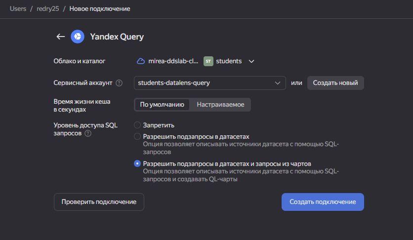
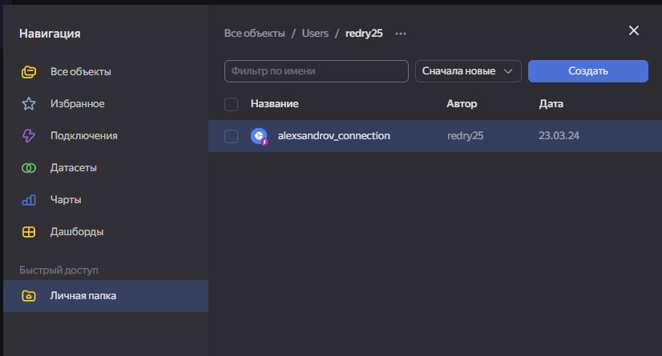
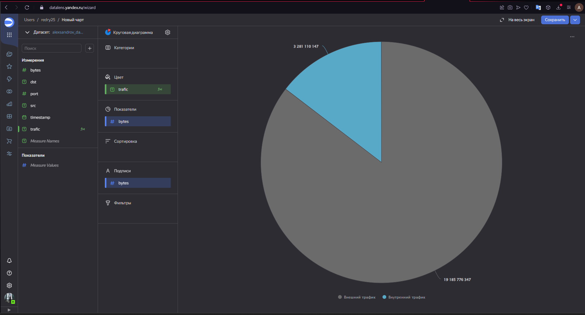
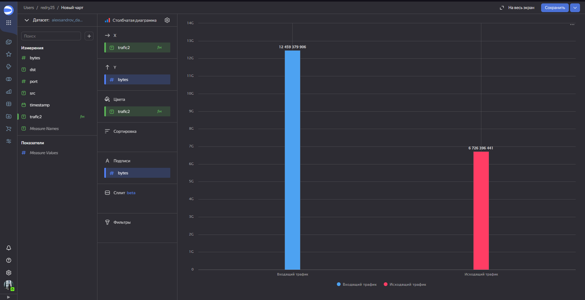
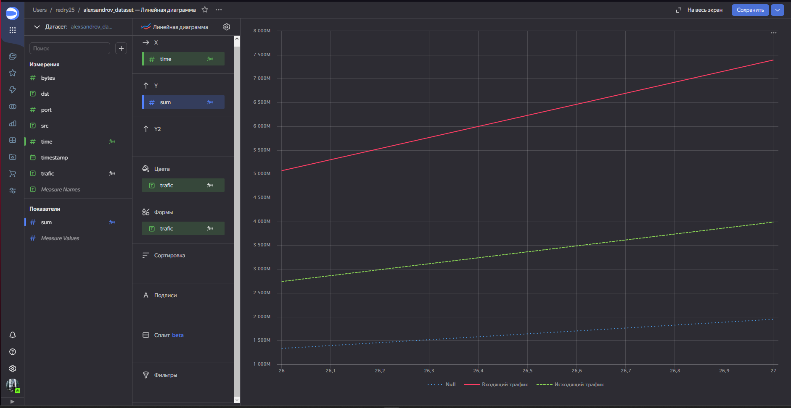
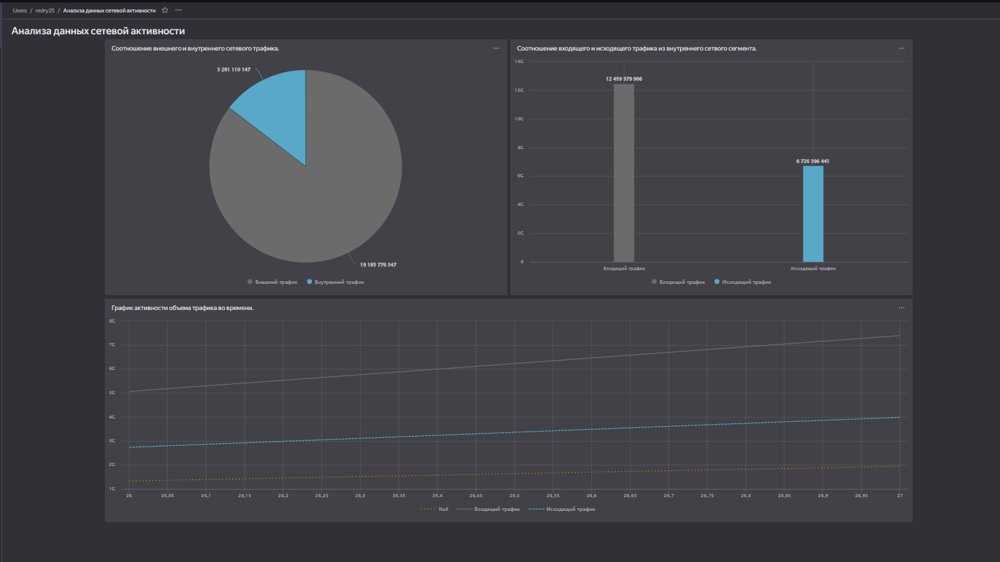

# PR2
Александров Андрей

# Использование технологии Yandex DataLens для анализа данных сетевой активности

## Ссылка на дашборд

https://datalens.yandex/lryjcgj2qdzm9

## Цель

1.  Изучить возможности технологии Yandex DataLens для визуального
    анализа структурированных наборов данных.

2.  Получить навыки визуализации данных для последующего анализа с
    помощью сервисов Yandex Cloud.

3.  Получить навыки создания решений мониторинга/SIEM на базе облачных
    продуктов и открытых программных решений.

4.  Закрепить практические навыки использования SQL для анализа данных
    сетевой активности в сегментированной корпоративной сети.

## Исходные данные

1.  ОС Windows 11

2.  RStudio

3.  Yandex Cloud

4.  Yandex Query

## Задание

Используя сервис Yandex DataLens настроить доступ к результатам Yandex
Query, полученным в ходе выполнения практической работы №1, и визуально
представить результаты анализа данных.

## Задачи

-   Представить в виде круговой диаграммы соотношение внешнего и
    внутреннего сетевого трафика.

-   Представить в виде столбчатой диаграммы соотношение входящего и
    исходящего трафика из внутреннего сетвого сегмента.

-   Построить график активности (линейная диаграмма) объема трафика во
    времени.

-   Все построенные графики вывести в виде единого дашборда в Yandex
    DataLens.

## Ход работы

#### Настроить подключение к Yandex Query из DataLens

-   Перейти в соответствующий сервис – https://datalens.yandex.ru/

-   Выбрать “Подключения” – “Создать новое подключение”

-   Выбрать в разделе “Файлы и сервисы” Yandex Query

-   Настроить и проверить подключение





#### Создать из запроса YandexQuery датасет DataLens


#### Делаем нужные графики и диаграммы

-   Представить в виде круговой диаграммы соотношение внешнего и
    внутреннего сетевого трафика.

<!-- -->

    IF (([src] LIKE '12.%' OR [src] LIKE '13.%' OR [src] LIKE '14.%') AND ([dst] LIKE '12.%' OR [dst] LIKE '13.%' OR [dst] LIKE '14.%'))
      THEN 'Внутренний трафик'
    ELSE
      'Внешний трафик'
    END

``` r
3+2
```

    [1] 5

Если значение в столбце src начинается с “12.”, “13.” или “14.” и
значение в столбце dst также начинается с “12.”, “13.” или “14.”, то
условие считается истинным и результатом будет “Внутренний трафик”.

Если условие не выполняется (значение в src и dst не начинается с “12.”,
“13.” или “14.”), то результатом будет “Внешний трафик”.



-   Представить в виде столбчатой диаграммы соотношение входящего и
    исходящего трафика из внутреннего сетвого сегмента.

<!-- -->

    IF (LEFT([src], 3) IN ('12.', '13.', '14.') AND LEFT([dst], 3) NOT IN ('12.', '13.', '14.'))
        THEN 'Исходящий трафик'
    ELSEIF (LEFT([dst], 3) IN ('12.', '13.', '14.') AND LEFT([src], 3) NOT IN ('12.', '13.', '14.'))
        THEN 'Входящий трафик'
    ELSE
        NULL
    END

Используем функцию LEFT, чтобы получить первые три символа из столбцов
src и dst и сравнить их со списком значений (‘12.’, ‘13.’, ‘14.’). Это
позволяет нам определить, принадлежит ли источник или назначение к
внутреннему трафику, и соответственно классифицировать его как
“Исходящий трафик” или “Входящий трафик”. Если ни одно из условий не
выполняется, результат будет NULL.



-   Построить график активности (линейная диаграмма) объема трафика во
    времени.



-   Все построенные графики вывести в виде единого дашборда в Yandex
    DataLens.



## Оценка результатов

Было создано несколько графиков на основе предоставленного набора
данных, а также был создан дашборд, объединяющий эти графики.

## Вывод

-   Технология Yandex DataLens предоставляет возможности для визуального
    анализа структурированных наборов данных. Это позволяет легко и
    удобно проводить анализ данных и получать ценную информацию из них.

-   Сервисы Yandex Cloud предоставляют мощные инструменты для
    визуализации данных, которые позволяют проводить анализ данных и
    делать выводы на основе полученной информации.

-   Создание решений мониторинга и системы SIEM на базе облачных
    продуктов и открытых программных решений помогает обеспечить
    безопасность и контроль в сетевой активности. Это важно для защиты
    корпоративной сети от угроз и атак.

-   Использование SQL для анализа данных сетевой активности в
    сегментированной корпоративной сети позволяет эффективно извлекать и
    обрабатывать нужную информацию из больших объемов данных. Это
    помогает в проведении анализа и принятии решений на основе
    полученных данных.
