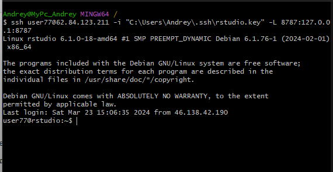
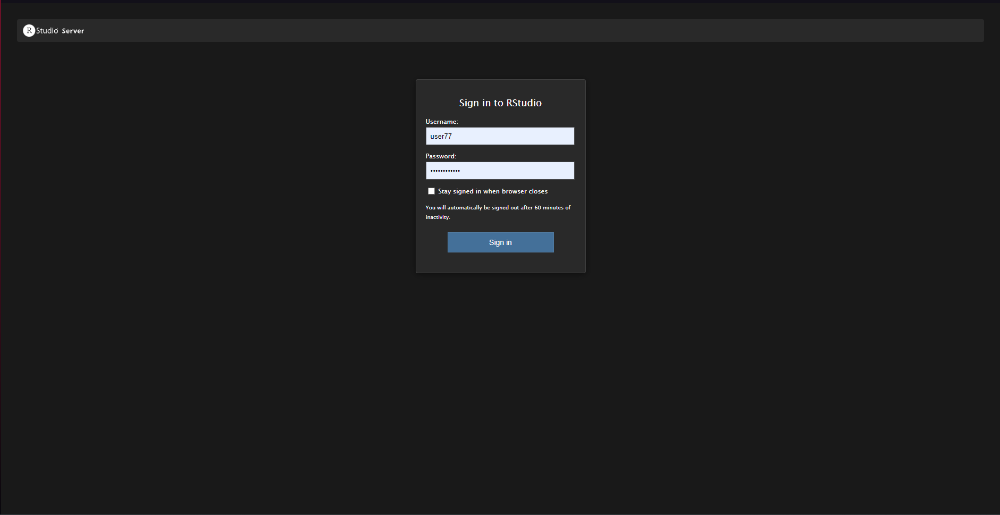

# Практическая работа 3

## Цель работы

1.  Изучить возможности технологии Apache Arrow для обработки и анализ
    больших данных.

2.  Получить навыки применения Arrow совместно с языком программирования
    R.

3.  Получить навыки анализа метаинфомации о сетевом трафике.

4.  Получить навыки применения облачных технологий хранения, подготовки
    и анализа данных: Yandex Object Storage, Rstudio Server.

## Исходные данные

1.  ОС Windows 11.

2.  Apache Arrow.

3.  RStudio.

4.  Yandex Object Storage.

## План

1.  Войдем в RStudio через SSH с использованием учетных данных
    пользователя.

2.  Выполним практическое задание.

3.  Составим отчет, в котором будет описан наш подход, результаты и
    выводы.

## Ход работы

-   Подключаемся по SSH к RStudio Server

<!-- -->

    ssh user77@62.84.123.211 -i "C:\Users\Andrey\.ssh\rstudio.key" -L 8787:127.0.0.1:8787



-   Меняем пароль и заходит под своим аккаунтом.



-   Выполняем практическое задание:

``` r
library(arrow, warn.conflicts = FALSE)
```

    Some features are not enabled in this build of Arrow. Run `arrow_info()` for more information.

``` r
library(tidyverse, warn.conflicts = FALSE)
```

    ── Attaching core tidyverse packages ──────────────────────── tidyverse 2.0.0 ──
    ✔ dplyr     1.1.4     ✔ readr     2.1.5
    ✔ forcats   1.0.0     ✔ stringr   1.5.1
    ✔ ggplot2   3.4.4     ✔ tibble    3.2.1
    ✔ lubridate 1.9.3     ✔ tidyr     1.3.1
    ✔ purrr     1.0.2     

    ── Conflicts ────────────────────────────────────────── tidyverse_conflicts() ──
    ✖ lubridate::duration() masks arrow::duration()
    ✖ dplyr::filter()       masks stats::filter()
    ✖ dplyr::lag()          masks stats::lag()
    ℹ Use the conflicted package (<http://conflicted.r-lib.org/>) to force all conflicts to become errors

-   Arrow - это библиотека для работы с структурированными данными в
    формате Apache Arrow. Она предоставляет эффективные и быстрые методы
    для чтения, записи и манипулирования данными.

-   Tidyverse - это набор пакетов R, который предоставляет удобный и
    последовательный подход к анализу данных. Он включает в себя
    множество пакетов, таких как ggplot2, dplyr, tidyr и др., которые
    делают работу с данными более удобной и эффективной.

-   Параметр warn.conflicts = FALSE используется для отключения
    предупреждений о возможных конфликтах имен функций при загрузке
    библиотеки.

### Задание 1: Надите утечку данных из Вашей сети

Важнейшие документы с результатами нашей исследовательской деятельности
в области создания вакцин скачиваются в виде больших заархивированных
дампов. Один из хостов в нашей сети используется для пересылки этой
информации – он пересылает гораздо больше информации на внешние ресурсы
в Интернете, чем остальные компьютеры нашей сети. Определите его
IP-адрес.

``` r
dir.create("src", showWarnings = FALSE)

curl::multi_download(
"https://storage.yandexcloud.net/arrow-datasets/tm_data.pqt",
"src/dataframe",
resume = TRUE
)
```

    # A tibble: 1 × 10
      success status_code resumefrom url    destfile error type  modified
      <lgl>         <int>      <dbl> <chr>  <chr>    <chr> <chr> <dttm>  
    1 TRUE            416          0 https… /home/u… <NA>  appl… NA      
    # ℹ 2 more variables: time <dbl>, headers <list>

Создаем директорию src и загружаем в нее dataframe

``` r
dataframe <- open_dataset(
  sources = "src/dataframe",
  schema = schema(timestamp=int64(),src=utf8(),dst=utf8(),port=uint32(),bytes=uint32())
)
glimpse(dataframe) 
```

    FileSystemDataset with 1 Parquet file
    105,747,730 rows x 5 columns
    $ timestamp <int64> 1578326400001, 1578326400005, 1578326400007, 1578326400011, …
    $ src      <string> "13.43.52.51", "16.79.101.100", "18.43.118.103", "15.71.108.…
    $ dst      <string> "18.70.112.62", "12.48.65.39", "14.51.30.86", "14.50.119.33"…
    $ port     <uint32> 40, 92, 27, 57, 115, 92, 65, 123, 79, 72, 123, 123, 22, 118,…
    $ bytes    <uint32> 57354, 11895, 898, 7496, 20979, 8620, 46033, 1500, 979, 1036…

Функция open_dataset() используется для открытия набора данных в формате
Apache Arrow. В данном случае, мы открываем набор данных из источника
“src/dataframe”. Параметр sources указывает путь к файлу данных.
Параметр schema указывает схему данных, которая включает описание типов
и структуры столбцов в наборе данных.

Функция glimpse() из пакета dplyr используется для вывода краткой
информации о наборе данных.

``` r
leak1 <- dataframe %>%
  filter(
    str_detect(src, "^(12|13|14)\\.") & 
    !str_detect(dst, "^(12|13|14)\\.")
  ) %>%
  group_by(src) %>%
  summarise(sum = sum(bytes)) %>%
  filter(sum > 6000000000) %>%
  select(src, sum) %>%
  collect()
cat(leak1$src)
```

    13.37.84.125

filter: Фильтрация dataframe на основе условий, указанных в функции
str_detect. Он оставляет только те строки, где столбец src начинается с
“12”, “13” или “14”, а столбец dst не начинается с “12”, “13” или “14”.
group_by: Группировка отфильтрованных данных по столбцу src. summarise:
Вычисление суммы значений столбца bytes для каждой группы (уникальные
значения src). filter: Фильтрация сгруппированных данных на основе
условия, что сумма байтов (sum) больше 6000000000. select: Выбор
столбцов src и sum. collect: Сбор результирующего набора данных из
распределенного набора данных Spark в локальный набор данных в R. cat:
Вывод значений столбца src из leak1 в консоль.

### Задание 2: Надите утечку данных 2

Другой атакующий установил автоматическую задачу в системном
планировщике cron для экспорта содержимого внутренней wiki системы. Эта
система генерирует большое количество трафика в нерабочие часы, больше
чем остальные хосты. Определите IP этой системы. Известно, что ее IP
адрес отличается от нарушителя из предыдущей задачи.

``` r
leak2 <- dataframe %>%
  select(timestamp, src, dst, bytes) %>%
  filter(str_detect(src, "^((12|13|14)\\.)") & !str_detect(dst, "^((12|13|14)\\.)")) %>%
  mutate(time = hour(as_datetime(timestamp / 1000))) %>%
  filter(time >= 0 & time <= 24) %>%
  count(time, name = "trafictime") %>%
  arrange(desc(trafictime)) %>%
  collect()
```

select: Выбор столбцов timestamp, src, dst и bytes из dataframe. filter:
Фильтрация данных на основе условий, указанных в функциях str_detect. Он
оставляет только те строки, где столбец src начинается с “12”, “13” или
“14”, а столбец dst не начинается с “12”, “13” или “14”. mutate:
Создание нового столбца time, который содержит часы из timestamp после
преобразования в формат даты/времени. filter: Фильтрация данных на
основе условий, что time находится в диапазоне от 0 до 24. count:
Подсчет количества строк для каждого значения time и назначение
результатов столбцу trafictime. arrange: Сортировка данных в порядке
убывания по столбцу trafictime.

-   Рабочее время с 16 до 24.

``` r
leak2_1 <- dataframe %>%
  mutate(time = hour(as_datetime(timestamp / 1000))) %>%
  filter(!str_detect(src, "^13.37.84.125"),
         (str_detect(src, "^12.") | str_detect(src, "^13.") | str_detect(src, "^14.")),
         (!str_detect(dst, "^12.") | !str_detect(dst, "^13.") | !str_detect(dst, "^14.")),
         time >= 1 & time <= 15) %>%
  group_by(src) %>%
  summarise(sum = sum(bytes)) %>%
  filter(sum > 290000000) %>%
  select(src, sum) %>%
  collect()
cat(leak2_1$src)
```

    12.55.77.96

mutate: Создание нового столбца time, который содержит часы из timestamp
после преобразования в формат даты/времени. filter: Фильтрация данных на
основе нескольких условий, указанных в функциях str_detect. Он оставляет
только те строки, где столбец src не начинается с “13.37.84.125”, а
столбец src начинается с “12.”, “13.” или “14.”, и столбец dst не
начинается с “12.”, “13.” или “14.”, а также time находится в диапазоне
от 1 до 15. group_by: Группировка данных по столбцу src. summarise:
Вычисление суммы байтов (bytes) для каждой группы src и назначение
результатов столбцу sum. filter: Фильтрация данных на основе условия,
что сумма (sum) больше 290000000. select: Выбор столбцов src и sum для
результирующего набора данных.

### Задание 3: Надите утечку данных 3

Еще один нарушитель собирает содержимое электронной почты и отправляет в
Интернет используя порт, который обычно используется для другого типа
трафика. Атакующий пересылает большое количество информации используя
этот порт, которое нехарактерно для других хостов, использующих этот
номер порта. Определите IP этой системы. Известно, что ее IP адрес
отличается от нарушителей из предыдущих задач.

``` r
leak3 <- dataframe %>%
  filter(!str_detect(src, "^13.37.84.125"),
         !str_detect(src, "^12.55.77.96"),
         (str_detect(src, "^12.") | str_detect(src, "^13.") | str_detect(src, "^14.")),
         (!str_detect(dst, "^12.") | !str_detect(dst, "^13.") | !str_detect(dst, "^14.")))  %>% 
  select(src, bytes, port) 


leak3_1 <- leak3 %>%  
  group_by(port) %>% 
  summarise("mean"=mean(bytes), "max"=max(bytes), "sum" = sum(bytes)) %>% 
  mutate("difference"= max-mean)  %>% filter(difference!=0, difference>170000) %>%
  collect()
```

filter: Фильтрация данных на основе нескольких условий, указанных в
функциях str_detect. Он оставляет только те строки, где столбец src не
начинается с “13.37.84.125” и не начинается с “12.55.77.96”, а столбец
src начинается с “12.”, “13.” или “14.”, и столбец dst не начинается с
“12.”, “13.” или “14.”. select: Выбор столбцов src, bytes и port для
результирующего набора данных leak3. group_by: Группировка данных по
столбцу port. summarise: Вычисление среднего (mean), максимального (max)
и суммы (sum) значений столбца bytes для каждой группы port. mutate:
Создание нового столбца difference, который содержит разницу между
максимальным значением и средним значением столбца bytes. filter:
Фильтрация данных на основе условия, что столбец difference не равен 0 и
больше 170000.

``` r
leak3_2 <- leak3 %>%
  filter(port == 37) %>%
  group_by(src) %>%
  summarise(mean = mean(bytes)) %>%
  filter(mean > 37543) %>%
  select(src) %>%
  collect()
cat(leak3_2$src)
```

    13.46.35.35

filter: Фильтрация данных в leak3 на основе условия, что значение
столбца port равно 37. group_by: Группировка данных по столбцу src.
summarise: Вычисление среднего (mean) значения столбца bytes для каждой
группы src. filter: Фильтрация данных на основе условия, что значение
столбца mean больше 37543. select: Выбор столбца src для результирующего
набора данных.

### Оценка результата

Успешное выполнение задачи было достигнуто благодаря использованию
облачных технологий, включая RStudio и Apache Arrow. В процессе работы с
Apache Arrow удалось ознакомиться с его функциональностью и эффективно
использовать его возможности для выполнения поставленной задачи.

### Вывод

В рамках данной работы была получена ценная практическая опытность в
применении облачных технологий для хранения, подготовки и анализа
данных. Благодаря этому удалось успешно провести анализ метаинформации о
сетевом трафике и получить полезные результаты.
